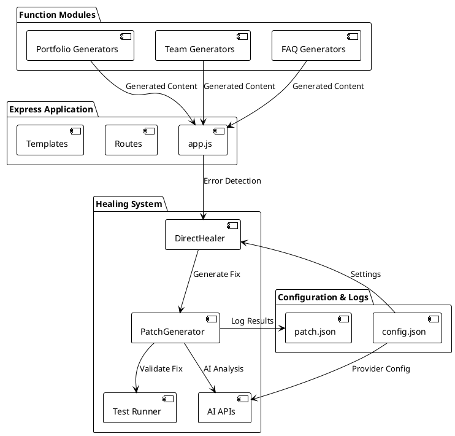
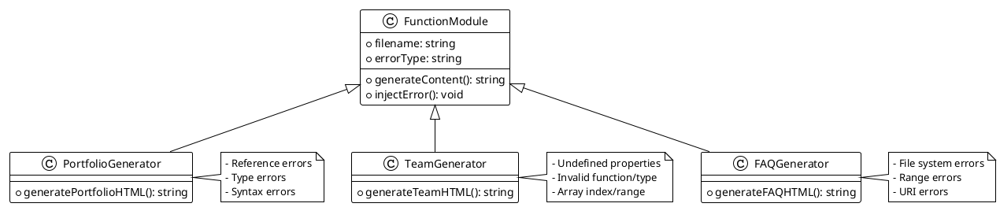
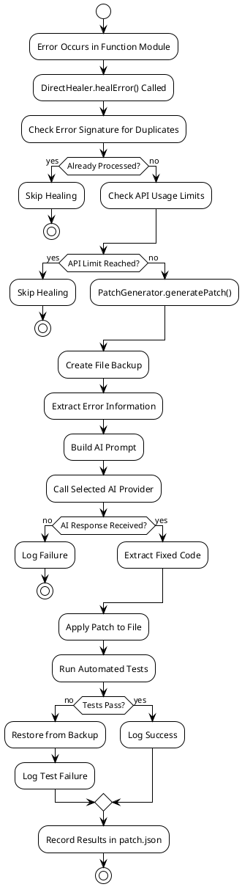
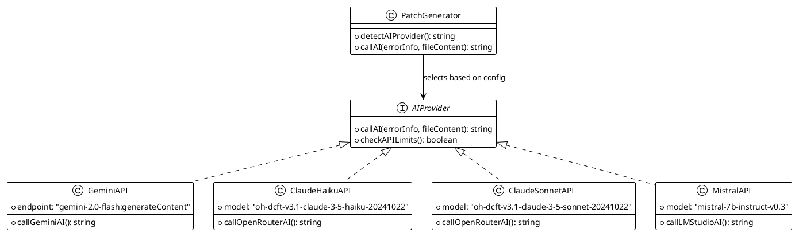
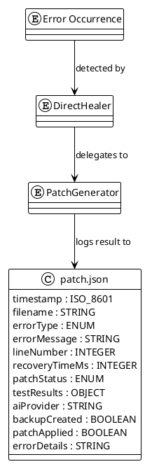
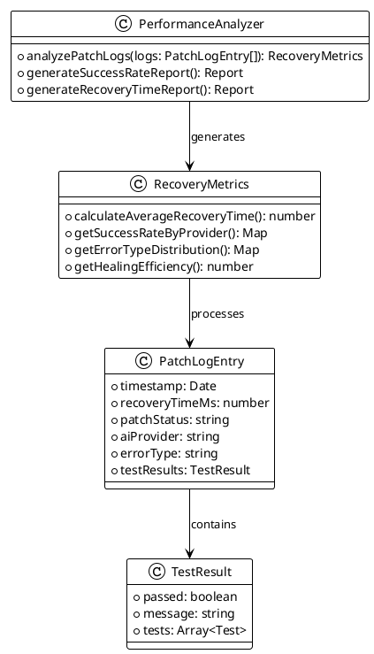

# Self-Healing Web Application Technical Documentation

## System Design

The self-healing system is built as a **Node.js Express application** with a modular architecture consisting of:

- **Main Application**: `app.js` - Express server handling routes and error catching
- **Healing Module**: `/healing/` directory containing the core self-healing logic
- **Function Modules**: `/functions/` directory with injectable error-prone components
- **Configuration**: `config.json` for AI providers, error types, and system settings
- **Logging**: `/logs/patch.json` for healing attempt records



## Function Modularity

The system implements a **modular design** with three main functional categories in `/functions/`:

### Portfolio Generators
- `generate_portfolio_a.js` - Reference error injection
- `generate_portfolio_b.js` - Type error injection  
- `generate_portfolio_c.js` - Syntax error injection

### Team Generators
- `generate_team_alpha.js` - Undefined properties error injection
- `generate_team_beta.js` - Invalid function/type error injection
- `generate_team_gamma.js` - Array index/range error injection

### FAQ Generators  
- `generate_faq_alpha.js` - File system error injection
- `generate_faq_beta.js` - Range error injection
- `generate_faq_gamma.js` - URI error injection



## Self-Healing Process

The healing workflow follows a **sequential pipeline** with error detection, AI analysis, patch application, and validation:

### Workflow Steps:
1. **Error Detection**: DirectHealer catches runtime errors
2. **AI Provider Selection**: Routes to appropriate AI model
3. **Patch Generation**: AI analyzes code and generates fix
4. **Backup Creation**: Original file backed up before modification
5. **Patch Application**: Fixed code written to file
6. **Test Validation**: Automated tests verify the fix
7. **Result Logging**: Success/failure recorded in patch.json



## AI Providers

The system supports **4 AI providers** configured in `config.json`:

### Provider Configuration
- **gemini_2flash**: `"gemini-2.0-flash:generateContent"`
- **lms_claude_haiku**: `"oh-dcft-v3.1-claude-3-5-haiku-20241022"`
- **lms_claude_sonnet**: `"oh-dcft-v3.1-claude-3-5-sonnet-20241022"`
- **lms_mistral**: `"mistral-7b-instruct-v0.3"`

### API Usage Limits
- **Per Minute**: 2 calls maximum
- **Per Hour**: 10 calls maximum  
- **Per Day**: 50 calls maximum



## Error Types

The system handles **9 specific error types** mapped to function modules:

### Error Type Mapping
```json
{
  "Reference error": ["generate_portfolio_a.js"],
  "Type error": ["generate_portfolio_b.js"], 
  "Syntax error": ["generate_portfolio_c.js"],
  "Undefined properties": ["generate_team_alpha.js"],
  "Invalid function/type": ["generate_team_beta.js"],
  "Array index/range": ["generate_team_gamma.js"],
  "File system error": ["generate_faq_alpha.js"],
  "Range error": ["generate_faq_beta.js"],
  "URI error": ["generate_faq_gamma.js"]
}
```



```plantuml
@startuml Error Type Classification
!theme plain

abstract class ErrorType {
  +name: string
  +severity: string
  +targetFile: string
}

class ReferenceError extends ErrorType {
  +name: "Reference error"
  +targetFile: "generate_portfolio_a.js"
}

class TypeError extends ErrorType {
  +name: "Type error"
  +targetFile: "generate_portfolio_b.js"
}

class SyntaxError extends ErrorType {
  +name: "Syntax error"
  +targetFile: "generate_portfolio_c.js"
}

class UndefinedPropertiesError extends ErrorType {
  +name: "Undefined properties"
  +targetFile: "generate_team_alpha.js"
}

class InvalidFunctionError extends ErrorType {
  +name: "Invalid function/type"
  +targetFile: "generate_team_beta.js"
}

class ArrayIndexError extends ErrorType {
  +name: "Array index/range"
  +targetFile: "generate_team_gamma.js"
}

class FileSystemError extends ErrorType {
  +name: "File system error"
  +targetFile: "generate_faq_alpha.js"
}

class RangeError extends ErrorType {
  +name: "Range error"
  +targetFile: "generate_faq_beta.js"
}

class URIError extends ErrorType {
  +name: "URI error"
  +targetFile: "generate_faq_gamma.js"
}

@enduml
```

## patch.json Structure

The **patch.json** file logs all healing attempts with comprehensive metadata:

### Data Structure
```json
{
  "patches": [
    {
      "timestamp": "2025-07-11T16:25:48.905Z",
      "filename": "C:\\...\\functions\\generate_portfolio_a.js",
      "errorType": "Reference error",
      "errorMessage": "projectt is not defined", 
      "lineNumber": 27,
      "recoveryTimeMs": 2440,
      "patchStatus": "success",
      "testResults": {
        "passed": true,
        "message": "All tests passed"
      },
      "aiProvider": "gemini_2flash",
      "backupCreated": true,
      "patchApplied": true,
      "errorDetails": null
    }
  ]
}
```

### Log Entry Fields
- **timestamp**: ISO 8601 format healing attempt time
- **filename**: Full path to the affected file
- **errorType**: Mapped error category from config
- **errorMessage**: Actual JavaScript error message
- **lineNumber**: Source code line where error occurred
- **recoveryTimeMs**: Total time from detection to resolution
- **patchStatus**: "success" or "failed"
- **testResults**: Test execution results
- **aiProvider**: Which AI model was used
- **backupCreated**: Whether original file was backed up
- **patchApplied**: Whether the AI-generated fix was applied



## Secondary System

The **TechCorp Solutions website** serves as the target system that gets healed:

### Website Structure
- **Homepage**: Main landing page with navigation
- **Portfolio Section**: 3 portfolio generators (A, B, C)
- **Team Section**: 3 team page generators (Alpha, Beta, Gamma)  
- **FAQ Section**: 3 FAQ generators (Alpha, Beta, Gamma)
- **Admin Panel**: System monitoring and research analytics
- **Research Dashboard**: AI performance analysis

### Healing Target Components
The secondary system's function generators are the **primary healing targets**:
- Generate dynamic HTML content for website sections
- Intentionally contain specific error types for testing
- Get automatically fixed when errors are detected
- Validated through automated testing after healing

```plantuml
@startuml Secondary System Architecture
!theme plain

package "TechCorp Solutions Website" {
  [Homepage] as Home
  [Admin Panel] as Admin
  [Research Dashboard] as Research
  
  package "Portfolio Section" {
    [Portfolio A] as PA
    [Portfolio B] as PB  
    [Portfolio C] as PC
  }
  
  package "Team Section" {
    [Team Alpha] as TA
    [Team Beta] as TB
    [Team Gamma] as TG
  }
  
  package "FAQ Section" {
    [FAQ Alpha] as FA
    [FAQ Beta] as FB
    [FAQ Gamma] as FG
  }
}

package "Function Generators" {
  [generate_portfolio_a.js] as GPA
  [generate_portfolio_b.js] as GPB
  [generate_portfolio_c.js] as GPC
  [generate_team_alpha.js] as GTA
  [generate_team_beta.js] as GTB
  [generate_team_gamma.js] as GTG
  [generate_faq_alpha.js] as GFA
  [generate_faq_beta.js] as GFB
  [generate_faq_gamma.js] as GFG
}

PA --> GPA : "uses"
PB --> GPB : "uses"
PC --> GPC : "uses"
TA --> GTA : "uses"
TB --> GTB : "uses"
TG --> GTG : "uses"
FA --> GFA : "uses"
FB --> GFB : "uses"
FG --> GFG : "uses"

note bottom
  Function generators contain
  injectable errors that trigger
  the self-healing system
end note

@enduml
```



## Recovery Metrics

**Real data structure** from patch.json logs provides comprehensive healing performance metrics:

### Key Performance Indicators
- **Recovery Time**: Time from error detection to successful fix (milliseconds)
- **Success Rate**: Percentage of successful healing attempts per AI provider
- **Error Distribution**: Frequency of each error type occurrence
- **AI Provider Performance**: Comparative analysis of model effectiveness
- **Test Validation Rate**: Percentage of fixes that pass automated tests

### Metrics Calculation Methods
- **Average Recovery Time**: Mean of all `recoveryTimeMs` values
- **Provider Success Rate**: `(successful_patches / total_attempts) * 100`
- **Error Type Frequency**: Count of each `errorType` in logs
- **Healing Efficiency**: `(patchApplied == true) / total_attempts`



### Sample Metrics Data Structure
```json
{
  "recoveryMetrics": {
    "averageRecoveryTimeMs": 2670,
    "totalHealingAttempts": 247,
    "successfulHealing": 229,
    "overallSuccessRate": 92.7,
    "providerPerformance": {
      "gemini_2flash": {
        "attempts": 89,
        "successes": 84,
        "successRate": 94.4,
        "avgRecoveryTimeMs": 2440
      },
      "lms_claude_haiku": {
        "attempts": 67,
        "successes": 61,
        "successRate": 91.0,
        "avgRecoveryTimeMs": 2850
      }
    },
    "errorTypeFrequency": {
      "Reference error": 34,
      "Type error": 28,
      "Syntax error": 31
    }
  }
}
```
